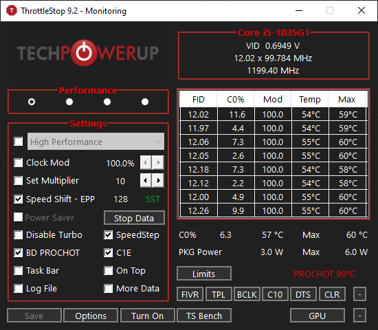
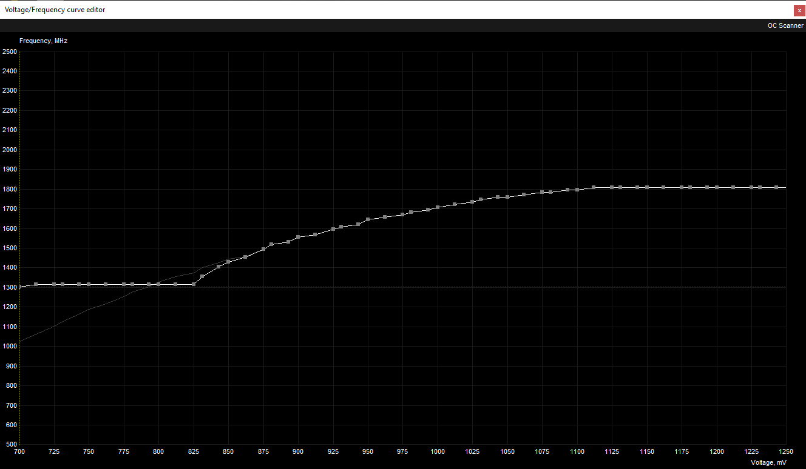

#Step 1 - Install Throttlestop and MSI after burner

#Step 2 - Open ThrottleStop and Follow the steps in Pictures

#Step 3 - Open MSI Afterburner and Press Ctrl + F and Set the curve as 

#Step 4 - Click on the first point of curve and press L to lock it.

#Step 5 - Set Power Plan to Ultimate Performance
    - Go to Start and search for CMD
    - Right click an "Run as adminstrator"
    - Enter the following command " powercfg -duplicatescheme e9a42b02-d5df-448d-aa00-03f14749eb61 "
    - Go to power plans and enable it.

#Step 6 - Turn off Intel Speedstep from BIOS 